# README


# [coiR](https://github.com/Edbbioeco/coiR)

> Package to calculate Canopy Openness Index (COI) from canopy images

# Installing package

``` r
require("devtools")

devtools::install_github("Edbbioeco/coiR")
```

# Loading package

`coiR` package is downloaded now, so we can library it. Additionally, we
library the following packages:

- [terra](https://rspatial.github.io/terra/): import images files as
  rasters;

- [purrr](https://purrr-tidyverse-org.translate.goog/?_x_tr_sl=en&_x_tr_tl=pt&_x_tr_hl=pt&_x_tr_pto=tc):
  create loops for multiple operations;

- [ggplot2](https://ggplot2.tidyverse.org): create elegant graphs for
  imported images;

- [tidyterra](https://dieghernan.github.io/tidyterra/): visualize RGB
  raster.

<div class="callout.Important">

Before load packages, make sure they are previously downloaded.

</div>

``` r
library(coiR)
```

    Carregando pacotes exigidos: terra

    terra 1.8.93

    Carregando pacotes exigidos: tidyterra


    Anexando pacote: 'tidyterra'

    O seguinte objeto é mascarado por 'package:stats':

        filter

    Carregando pacotes exigidos: dplyr


    Anexando pacote: 'dplyr'

    Os seguintes objetos são mascarados por 'package:terra':

        intersect, union

    Os seguintes objetos são mascarados por 'package:stats':

        filter, lag

    Os seguintes objetos são mascarados por 'package:base':

        intersect, setdiff, setequal, union

    Carregando pacotes exigidos: tidyr


    Anexando pacote: 'tidyr'

    O seguinte objeto é mascarado por 'package:terra':

        extract

    Carregando pacotes exigidos: magrittr


    Anexando pacote: 'magrittr'

    O seguinte objeto é mascarado por 'package:tidyr':

        extract

    Os seguintes objetos são mascarados por 'package:terra':

        extract, inset

    Carregando pacotes exigidos: forcats

    Carregando pacotes exigidos: ggplot2

    Carregando pacotes exigidos: purrr


    Anexando pacote: 'purrr'

    O seguinte objeto é mascarado por 'package:magrittr':

        set_names

    Carregando pacotes exigidos: readr

    Carregando pacotes exigidos: stringr

    Carregando pacotes exigidos: tibble

``` r
library(terra)

library(purrr)

library(ggplot2)

library(tidyterra)
```

# Data

## Importing

Now, we need to import our data. Images may be shotten photos, as .png,
.jpg or .jpeg files. first, we informe images directory (`files`), and
import them using `terra::rast()` function for every image, throught a
loop with `purrr::map()` function. Our images (`images`) are setted as a
list class object.

``` r
files <- paste0("cropped-images/imagem", 1:4, ".png")

files
```

    [1] "cropped-images/imagem1.png" "cropped-images/imagem2.png"
    [3] "cropped-images/imagem3.png" "cropped-images/imagem4.png"

``` r
images <- purrr::map(files,
                     terra::rast)
```

    Warning: [rast] unknown extent
    Warning: [rast] unknown extent
    Warning: [rast] unknown extent
    Warning: [rast] unknown extent

``` r
names(images) <- paste0("cropped-images/imagem", 1:4, ".png")

images
```

    $`cropped-images/imagem1.png`
    class       : SpatRaster 
    size        : 2971, 2971, 4  (nrow, ncol, nlyr)
    resolution  : 1, 1  (x, y)
    extent      : 0, 2971, 0, 2971  (xmin, xmax, ymin, ymax)
    coord. ref. :  
    source      : imagem1.png 
    names       : imagem1_1, imagem1_2, imagem1_3, imagem1_4 

    $`cropped-images/imagem2.png`
    class       : SpatRaster 
    size        : 2999, 2999, 4  (nrow, ncol, nlyr)
    resolution  : 1, 1  (x, y)
    extent      : 0, 2999, 0, 2999  (xmin, xmax, ymin, ymax)
    coord. ref. :  
    source      : imagem2.png 
    names       : imagem2_1, imagem2_2, imagem2_3, imagem2_4 

    $`cropped-images/imagem3.png`
    class       : SpatRaster 
    size        : 2999, 2999, 4  (nrow, ncol, nlyr)
    resolution  : 1, 1  (x, y)
    extent      : 0, 2999, 0, 2999  (xmin, xmax, ymin, ymax)
    coord. ref. :  
    source      : imagem3.png 
    names       : imagem3_1, imagem3_2, imagem3_3, imagem3_4 

    $`cropped-images/imagem4.png`
    class       : SpatRaster 
    size        : 3000, 3000, 4  (nrow, ncol, nlyr)
    resolution  : 1, 1  (x, y)
    extent      : 0, 3000, 0, 3000  (xmin, xmax, ymin, ymax)
    coord. ref. :  
    source      : imagem4.png 
    names       : imagem4_1, imagem4_2, imagem4_3, imagem4_4 

## Visualizing

Next, lets visualize every image, using a `purrr::map()` loop, through
`ggplot` and `tidyterra::geom_spatraster_rgb()` function.

``` r
purrr::map(images, function(data){ggplot() + tidyterra::geom_spatraster_rgb(data = data) + theme_void()})
```

    <SpatRaster> resampled to 501264 cells.
    <SpatRaster> resampled to 501264 cells.
    <SpatRaster> resampled to 501264 cells.
    <SpatRaster> resampled to 501264 cells.

    $`cropped-images/imagem1.png`

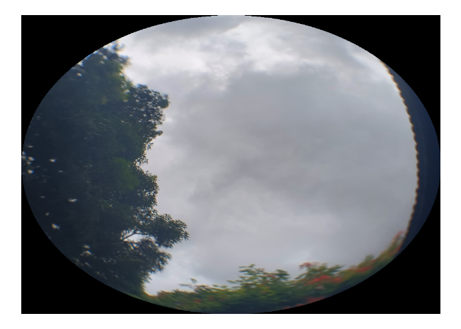


    $`cropped-images/imagem2.png`

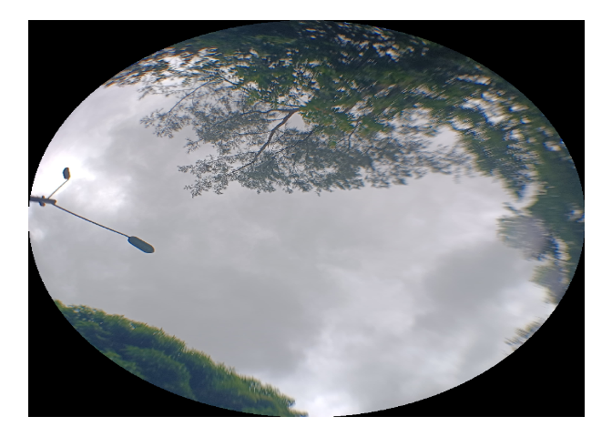


    $`cropped-images/imagem3.png`

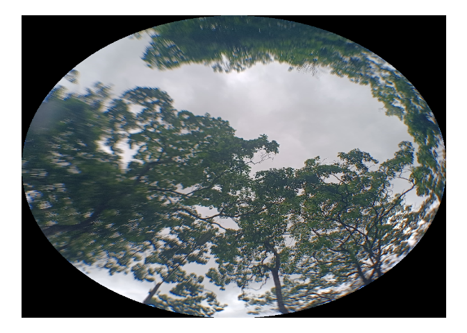


    $`cropped-images/imagem4.png`

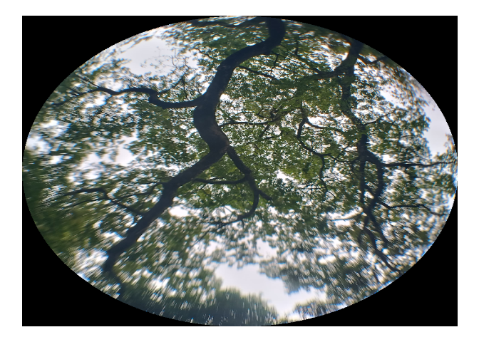

# Canopy Openness Index

## Isolating a single image

For our exemples, lets work in two ways: run for a single and run for
multiple images. Lets set first image as a single image.

``` r
single_image <- images[[1]]
```

## Crop image

Usely, canopy images are shotten photos, square images. For our
analysis, we need to crop images into circles. We use
`coiR::coir_crop()` \|function.

``` r
single_image |> 
  coiR::coir_crop()
```

    <SpatRaster> resampled to 501264 cells.

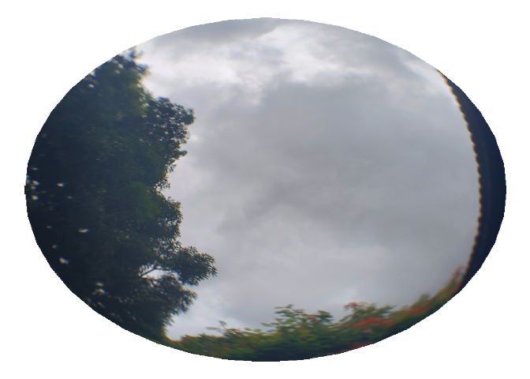

    class       : SpatRaster 
    size        : 2971, 2971, 4  (nrow, ncol, nlyr)
    resolution  : 1, 1  (x, y)
    extent      : 0, 2971, 0, 2971  (xmin, xmax, ymin, ymax)
    coord. ref. :  
    source(s)   : memory
    varname     : imagem1 
    names       : imagem1_1, imagem1_2, imagem1_3, imagem1_4 
    min values  :         0,         0,         0,         0 
    max values  :       246,       255,       255,       255 

And we also can analyse multiple images from an one shot, using
`purrr::map()` loop.

``` r
purrr::map(images, coiR::coir_crop)
```

    <SpatRaster> resampled to 501264 cells.


    <SpatRaster> resampled to 501264 cells.

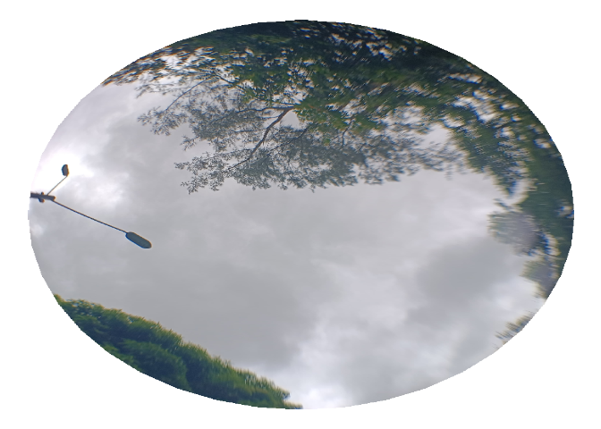

    <SpatRaster> resampled to 501264 cells.

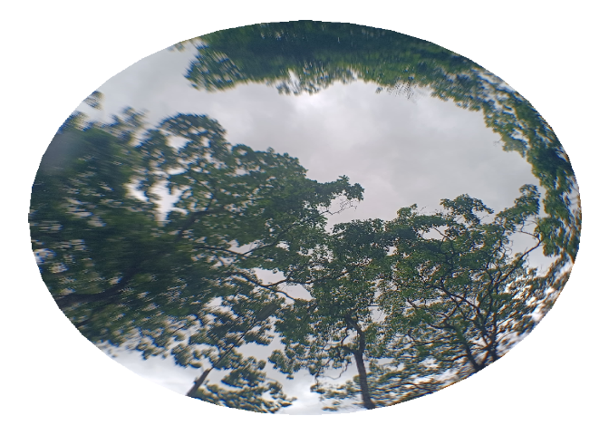

    <SpatRaster> resampled to 501264 cells.

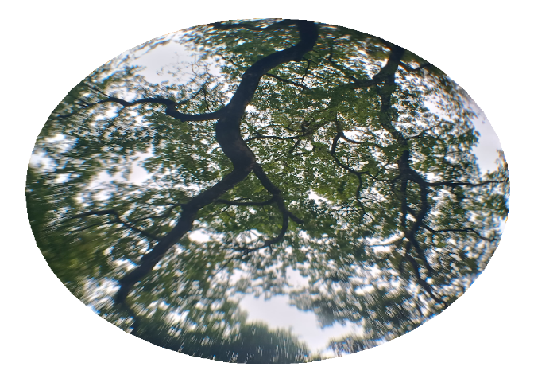

    $`cropped-images/imagem1.png`
    class       : SpatRaster 
    size        : 2971, 2971, 4  (nrow, ncol, nlyr)
    resolution  : 1, 1  (x, y)
    extent      : 0, 2971, 0, 2971  (xmin, xmax, ymin, ymax)
    coord. ref. :  
    source(s)   : memory
    varname     : imagem1 
    names       : imagem1_1, imagem1_2, imagem1_3, imagem1_4 
    min values  :         0,         0,         0,         0 
    max values  :       246,       255,       255,       255 

    $`cropped-images/imagem2.png`
    class       : SpatRaster 
    size        : 2999, 2999, 4  (nrow, ncol, nlyr)
    resolution  : 1, 1  (x, y)
    extent      : 0, 2999, 0, 2999  (xmin, xmax, ymin, ymax)
    coord. ref. :  
    source(s)   : memory
    varname     : imagem2 
    names       : imagem2_1, imagem2_2, imagem2_3, imagem2_4 
    min values  :         0,         0,         0,         0 
    max values  :       255,       255,       255,       255 

    $`cropped-images/imagem3.png`
    class       : SpatRaster 
    size        : 2999, 2999, 4  (nrow, ncol, nlyr)
    resolution  : 1, 1  (x, y)
    extent      : 0, 2999, 0, 2999  (xmin, xmax, ymin, ymax)
    coord. ref. :  
    source(s)   : memory
    varname     : imagem3 
    names       : imagem3_1, imagem3_2, imagem3_3, imagem3_4 
    min values  :         0,         0,         0,         0 
    max values  :       255,       255,       255,       255 

    $`cropped-images/imagem4.png`
    class       : SpatRaster 
    size        : 3000, 3000, 4  (nrow, ncol, nlyr)
    resolution  : 1, 1  (x, y)
    extent      : 0, 3000, 0, 3000  (xmin, xmax, ymin, ymax)
    coord. ref. :  
    source(s)   : memory
    varname     : imagem4 
    names       : imagem4_1, imagem4_2, imagem4_3, imagem4_4 
    min values  :         0,         0,         0,         5 
    max values  :       255,       255,       255,       255 

## Binarize images

Our next step is to binarize our images. We use `coiR::coir_binarize()`
function. To avoid replot canopy image, we use `plot = FALSE` argument
at `coiR::coir_crop()` function. To facilite our analysis, lets use pipe
(`|>`) to conect functions output.

``` r
single_image |> 
  coiR::coir_crop(plot = FALSE) |> 
  coiR::coir_binarize()
```

    <SpatRaster> resampled to 501264 cells.

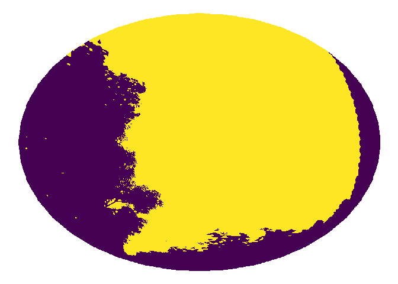

    class       : SpatRaster 
    size        : 2971, 2971, 1  (nrow, ncol, nlyr)
    resolution  : 1, 1  (x, y)
    extent      : 0, 2971, 0, 2971  (xmin, xmax, ymin, ymax)
    coord. ref. :  
    source(s)   : memory
    name        : variavel 
    min value   :        0 
    max value   :        1 

As previously made, we can binarize multiple images, making a function
in our `purrr::map()` loop.

``` r
purrr::map(images, function(images){coiR::coir_crop(data = images,
                                                    plot = FALSE) |>
    coiR::coir_binarize()})
```

    <SpatRaster> resampled to 501264 cells.


    <SpatRaster> resampled to 501264 cells.

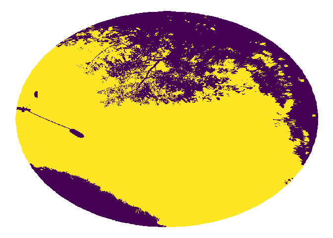

    <SpatRaster> resampled to 501264 cells.

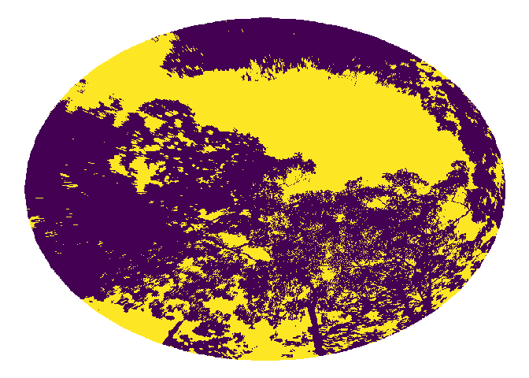

    <SpatRaster> resampled to 501264 cells.

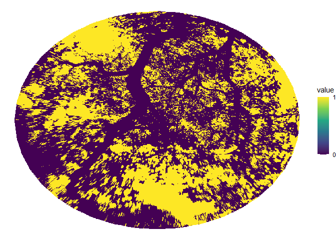

    $`cropped-images/imagem1.png`
    class       : SpatRaster 
    size        : 2971, 2971, 1  (nrow, ncol, nlyr)
    resolution  : 1, 1  (x, y)
    extent      : 0, 2971, 0, 2971  (xmin, xmax, ymin, ymax)
    coord. ref. :  
    source(s)   : memory
    name        : variavel 
    min value   :        0 
    max value   :        1 

    $`cropped-images/imagem2.png`
    class       : SpatRaster 
    size        : 2999, 2999, 1  (nrow, ncol, nlyr)
    resolution  : 1, 1  (x, y)
    extent      : 0, 2999, 0, 2999  (xmin, xmax, ymin, ymax)
    coord. ref. :  
    source(s)   : memory
    name        : variavel 
    min value   :        0 
    max value   :        1 

    $`cropped-images/imagem3.png`
    class       : SpatRaster 
    size        : 2999, 2999, 1  (nrow, ncol, nlyr)
    resolution  : 1, 1  (x, y)
    extent      : 0, 2999, 0, 2999  (xmin, xmax, ymin, ymax)
    coord. ref. :  
    source(s)   : memory
    name        : variavel 
    min value   :        0 
    max value   :        1 

    $`cropped-images/imagem4.png`
    class       : SpatRaster 
    size        : 3000, 3000, 1  (nrow, ncol, nlyr)
    resolution  : 1, 1  (x, y)
    extent      : 0, 3000, 0, 3000  (xmin, xmax, ymin, ymax)
    coord. ref. :  
    source(s)   : memory
    name        : variavel 
    min value   :        0 
    max value   :        1 

## Index

Finally, we get COI index. We use `coiR::coir_index()` for get that
value. To avoid replot cropped and binarized images, we set
`plot = FALSE` for both `coiR::coir_crop()` and `coiR::coir_binarize()`
functions.

``` r
single_image |> 
  coiR::coir_crop(plot = FALSE) |> 
  coiR::coir_binarize(plot = FALSE) |> 
  coiR::coir_index()
```

    [1] 0.51

As previously made, we can also do for multiple images, making a
function in `purrr::map()` function.

``` r
purrr::map(images, function(images){coiR::coir_crop(data = images,
                                                    plot = FALSE) |>
    coiR::coir_binarize(plot = FALSE) |> 
    coiR::coir_index()})
```

    $`cropped-images/imagem1.png`
    [1] 0.51

    $`cropped-images/imagem2.png`
    [1] 0.54

    $`cropped-images/imagem3.png`
    [1] 0.31

    $`cropped-images/imagem4.png`
    [1] 0.31

Additionally, we can set all COI values into a vector, to make a
dataframe. First, we make a null vector (`vector_index <- c()`). Next,
we build a function, hyper declaring a new `vector_index` with `<<-`
instead `<-`. For more values details, we set `round = 3` argument in
`coiR::coir_index()` functions, to set decimal places. All in a
`purrr::map()` loop.

> [!NOTE]
>
> A good practice to assist loops for images in coiR package is store
> them into a contained folder, where images file names got a pattern.

``` r
vector_index <- c()

multiple_index <- function(images, verbose = FALSE){
  
  index <- images |> 
    coiR::coir_crop(plot = FALSE) |>
    coiR::coir_binarize(plot = FALSE) |> 
    coiR::coir_index(round = 3)
  
  vector_index <<- c(vector_index, index)
  
}

purrr::map(images, multiple_index)
```

    $`cropped-images/imagem1.png`
    [1] 0.507

    $`cropped-images/imagem2.png`
    [1] 0.507 0.540

    $`cropped-images/imagem3.png`
    [1] 0.507 0.540 0.310

    $`cropped-images/imagem4.png`
    [1] 0.507 0.540 0.310 0.308

``` r
vector_index
```

    [1] 0.507 0.540 0.310 0.308

Finally, we make a data frame with those values.

> [!NOTE]
>
> That data frame can be exported for different file formats, such as
> .xlsx or .csv. That practice assists save analysis results.

``` r
df_index <- tibble::tibble(id = images |> names(),
                           Index = vector_index)

df_index
```

    # A tibble: 4 × 2
      id                         Index
      <chr>                      <dbl>
    1 cropped-images/imagem1.png 0.507
    2 cropped-images/imagem2.png 0.54 
    3 cropped-images/imagem3.png 0.31 
    4 cropped-images/imagem4.png 0.308
