# coiR
Edson Silva-Júnior
2026-09-29

# [coiR](https://github.com/Edbbioeco/coiR)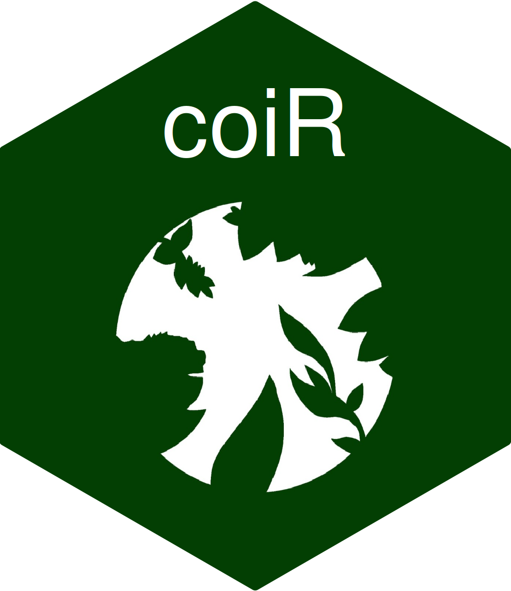

> Package to calculate Canopy Openness Index (COI) from canopy images

# Installing package

``` r
require("devtools")

devtools::install_github("Edbbioeco/coiR")
```

# Loading package

`coiR` package is downloaded now, so we can library it. Additionally, we
library the following packages:

- [terra](https://rspatial.github.io/terra/): import images files as
  rasters;

- [purrr](https://purrr-tidyverse-org.translate.goog/?_x_tr_sl=en&_x_tr_tl=pt&_x_tr_hl=pt&_x_tr_pto=tc):
  create loops for multiple operations;

- [ggplot2](https://ggplot2.tidyverse.org): create elegant graphs for
  imported images;

- [tidyterra](https://dieghernan.github.io/tidyterra/): visualize RGB
  raster

``` r
library(coiR)

library(terra)

library(purrr)

library(ggplot2)

library(tidyterra)
```

# Data

## Importing

Now, we need to import our data Images may be shotten photos, as .png,
.jpg or .jpeg files. first, we import package exemple data, using
`coiR::coir_data()` function, and import them using `terra::rast()`
function for every image, throught a loop with `purrr::map()` function.
Our images (`images`) are setted as a list class object.

``` r
images <- purrr::map(coiR::data_coir(),
                     ~.x |> terra::rast())

images
```

    [[1]]
    class       : SpatRaster
    size        : 800, 800, 4  (nrow, ncol, nlyr)
    resolution  : 1, 1  (x, y)
    extent      : 0, 800, 0, 800  (xmin, xmax, ymin, ymax)
    coord. ref. : 
    source      : imagem1.png
    names       : imagem1_1, imagem1_2, imagem1_3, imagem1_4

    [[2]]
    class       : SpatRaster
    size        : 800, 800, 4  (nrow, ncol, nlyr)
    resolution  : 1, 1  (x, y)
    extent      : 0, 800, 0, 800  (xmin, xmax, ymin, ymax)
    coord. ref. : 
    source      : imagem2.png
    names       : imagem2_1, imagem2_2, imagem2_3, imagem2_4

    [[3]]
    class       : SpatRaster
    size        : 800, 800, 4  (nrow, ncol, nlyr)
    resolution  : 1, 1  (x, y)
    extent      : 0, 800, 0, 800  (xmin, xmax, ymin, ymax)
    coord. ref. : 
    source      : imagem3.png
    names       : imagem3_1, imagem3_2, imagem3_3, imagem3_4

    [[4]]
    class       : SpatRaster
    size        : 800, 800, 4  (nrow, ncol, nlyr)
    resolution  : 1, 1  (x, y)
    extent      : 0, 800, 0, 800  (xmin, xmax, ymin, ymax)
    coord. ref. : 
    source      : imagem4.png
    names       : imagem4_1, imagem4_2, imagem4_3, imagem4_4

## Visualizing

Next, lets visualize every image, using a `purrr::map()` loop, through
`ggplot` and `tidyterra::geom_spatraster_rgb()` function.

``` r
purrr::map(images, 
           purrr::in_parallel(
             
             ~ggplot() + 
               tidyterra::geom_spatraster_rgb(data = .x) + 
               theme_void()
             
             ),
           .progress = TRUE)
```

    [[1]]

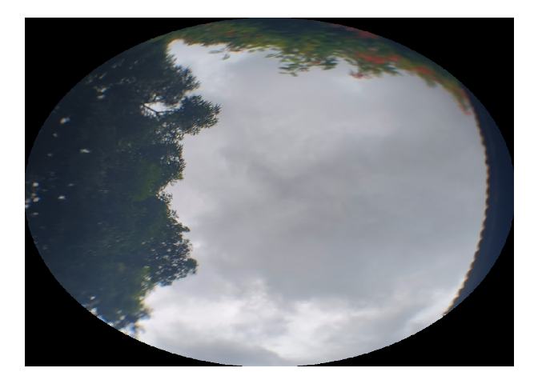


    [[2]]

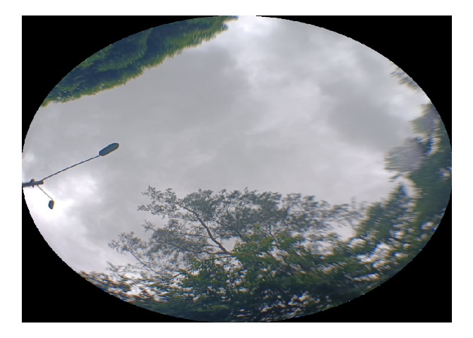


    [[3]]

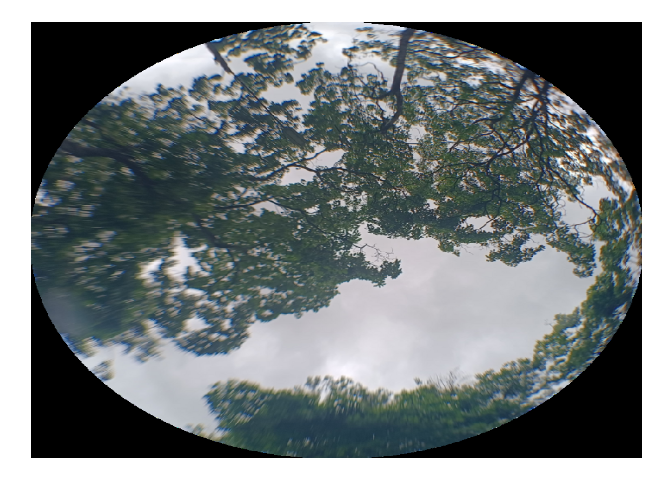


    [[4]]

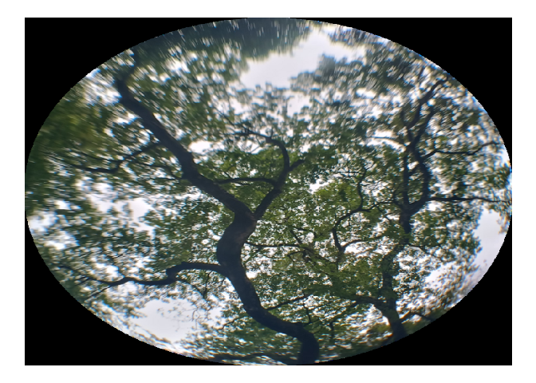

# Canopy Openness Index

## Isolating a single image

For our exemples, lets work in two ways: run for a single and run for
multiple images. Lets set first image as a single image.

``` r
single_image <- images[[1]]
```

## Crop image

Usely, canopy images are shotten photos, square images. For our
analysis, we need to crop images into circles. We use
`coiR::coir_crop()` \|function.

``` r
single_image |> 
  coiR::coir_crop()
```

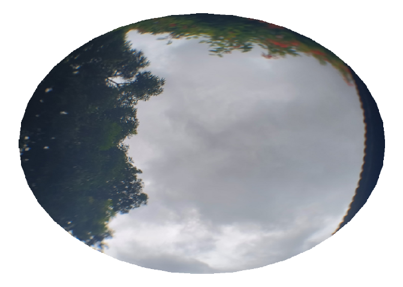

    class       : SpatRaster
    size        : 800, 800, 4  (nrow, ncol, nlyr)
    resolution  : 1, 1  (x, y)
    extent      : 0, 800, 0, 800  (xmin, xmax, ymin, ymax)
    coord. ref. : 
    source(s)   : memory
    varname     : imagem1
    names       : imagem1_1, imagem1_2, imagem1_3, imagem1_4
    min values  :         4,        25,        33,        29
    max values  :       243,       241,       246,       255

And we also can analyse multiple images from an one shot, using
`purrr::map()` loop.

``` r
purrr::map(images, coiR::coir_crop)
```


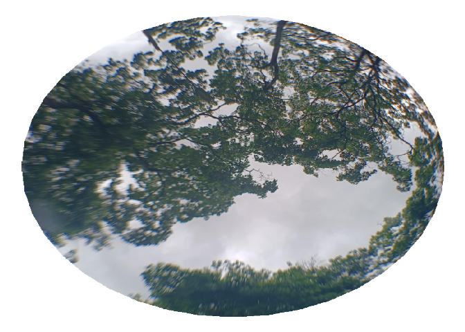

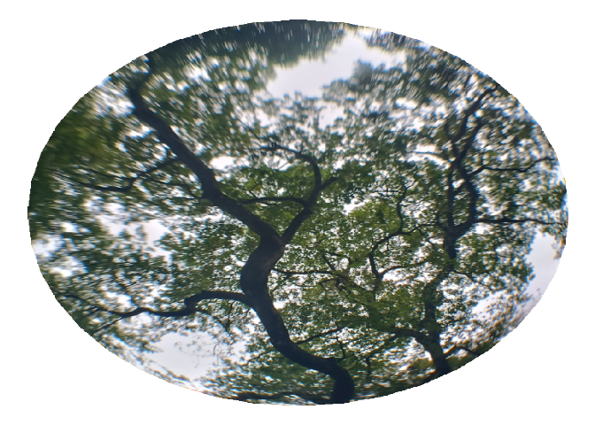

    [[1]]
    class       : SpatRaster
    size        : 800, 800, 4  (nrow, ncol, nlyr)
    resolution  : 1, 1  (x, y)
    extent      : 0, 800, 0, 800  (xmin, xmax, ymin, ymax)
    coord. ref. : 
    source(s)   : memory
    varname     : imagem1
    names       : imagem1_1, imagem1_2, imagem1_3, imagem1_4
    min values  :         4,        25,        33,        29
    max values  :       243,       241,       246,       255

    [[2]]
    class       : SpatRaster
    size        : 800, 800, 4  (nrow, ncol, nlyr)
    resolution  : 1, 1  (x, y)
    extent      : 0, 800, 0, 800  (xmin, xmax, ymin, ymax)
    coord. ref. : 
    source(s)   : memory
    varname     : imagem2
    names       : imagem2_1, imagem2_2, imagem2_3, imagem2_4
    min values  :         2,        21,        21,        29
    max values  :       255,       255,       255,       255

    [[3]]
    class       : SpatRaster
    size        : 800, 800, 4  (nrow, ncol, nlyr)
    resolution  : 1, 1  (x, y)
    extent      : 0, 800, 0, 800  (xmin, xmax, ymin, ymax)
    coord. ref. : 
    source(s)   : memory
    varname     : imagem3
    names       : imagem3_1, imagem3_2, imagem3_3, imagem3_4
    min values  :         3,        19,         7,        29
    max values  :       255,       255,       255,       255

    [[4]]
    class       : SpatRaster
    size        : 800, 800, 4  (nrow, ncol, nlyr)
    resolution  : 1, 1  (x, y)
    extent      : 0, 800, 0, 800  (xmin, xmax, ymin, ymax)
    coord. ref. : 
    source(s)   : memory
    varname     : imagem4
    names       : imagem4_1, imagem4_2, imagem4_3, imagem4_4
    min values  :         1,        13,         1,        30
    max values  :       255,       255,       255,       255

## Binarize images

Our next step is to binarize our images. We use `coiR::coir_binarize()`
function. To avoid replot canopy image, we use `plot = FALSE` argument
at `coiR::coir_crop()` function. To facilite our analysis, lets use pipe
(`|>`) to conect functions output.

``` r
single_image |> 
  coiR::coir_crop(plot = FALSE) |> 
  coiR::coir_binarize()
```

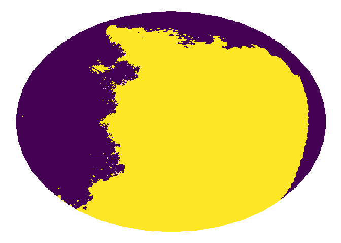

    class       : SpatRaster
    size        : 800, 800, 1  (nrow, ncol, nlyr)
    resolution  : 1, 1  (x, y)
    extent      : 0, 800, 0, 800  (xmin, xmax, ymin, ymax)
    coord. ref. : 
    source(s)   : memory
    name        : variavel
    min value   :        0
    max value   :        1

As previously made, we can binarize multiple images, making a function
in our `purrr::map()` loop.

``` r
purrr::map(images, 
           purrr::in_parallel(
             
             ~coiR::coir_crop(data = .x,
                              plot = FALSE) |>
               coiR::coir_binarize()
             
             ),
           .progress = TRUE)
```


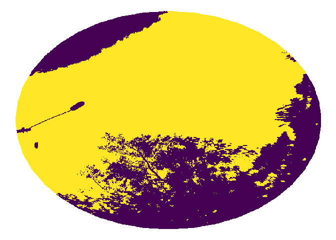

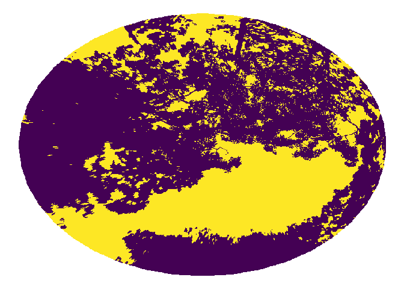

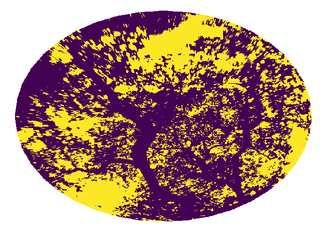

    [[1]]
    class       : SpatRaster
    size        : 800, 800, 1  (nrow, ncol, nlyr)
    resolution  : 1, 1  (x, y)
    extent      : 0, 800, 0, 800  (xmin, xmax, ymin, ymax)
    coord. ref. : 
    source(s)   : memory
    name        : variavel
    min value   :        0
    max value   :        1

    [[2]]
    class       : SpatRaster
    size        : 800, 800, 1  (nrow, ncol, nlyr)
    resolution  : 1, 1  (x, y)
    extent      : 0, 800, 0, 800  (xmin, xmax, ymin, ymax)
    coord. ref. : 
    source(s)   : memory
    name        : variavel
    min value   :        0
    max value   :        1

    [[3]]
    class       : SpatRaster
    size        : 800, 800, 1  (nrow, ncol, nlyr)
    resolution  : 1, 1  (x, y)
    extent      : 0, 800, 0, 800  (xmin, xmax, ymin, ymax)
    coord. ref. : 
    source(s)   : memory
    name        : variavel
    min value   :        0
    max value   :        1

    [[4]]
    class       : SpatRaster
    size        : 800, 800, 1  (nrow, ncol, nlyr)
    resolution  : 1, 1  (x, y)
    extent      : 0, 800, 0, 800  (xmin, xmax, ymin, ymax)
    coord. ref. : 
    source(s)   : memory
    name        : variavel
    min value   :        0
    max value   :        1

## Index

Finally, we get COI index. We use `coiR::coir_index()` for get that
value. To avoid replot cropped and binarized images, we set
`plot = FALSE` for both `coiR::coir_crop()` and `coiR::coir_binarize()`
functions.

``` r
single_image |> 
  coiR::coir_crop(plot = FALSE) |> 
  coiR::coir_binarize(plot = FALSE) |> 
  coiR::coir_index()
```

    [1] 0.5

As previously made, we can also do for multiple images, making a
function in `purrr::map_dbl()` function.

``` r
purrr::map_dbl(images, 
               purrr::in_parallel(
                 
      ~coiR::coir_crop(data = .x,
                       plot = FALSE) |>
        coiR::coir_binarize(plot = FALSE) |> 
        coiR::coir_index()
             
             ),
      .progress = TRUE)
```

    [1] 0.50 0.52 0.28 0.29

Finally, we make a data rame with those values, using
`purrr::imap_dfr()`, to get image names.

``` r
df_index <- purrr::imap_dfr(
  images, 
  purrr::in_parallel(
    
    \(imagem, nome){
      
      index <- imagem |> 
        coiR::coir_crop(plot = FALSE) |>
        coiR::coir_binarize(plot = FALSE) |> 
        coiR::coir_index(round = 3)
      
      tibble::tibble(id = nome,
                     Index = index)
      
      }
    
    ),
  .progress = TRUE)

df_index
```

    # A tibble: 4 × 2
         id Index
      <int> <dbl>
    1     1 0.501
    2     2 0.518
    3     3 0.281
    4     4 0.29 
